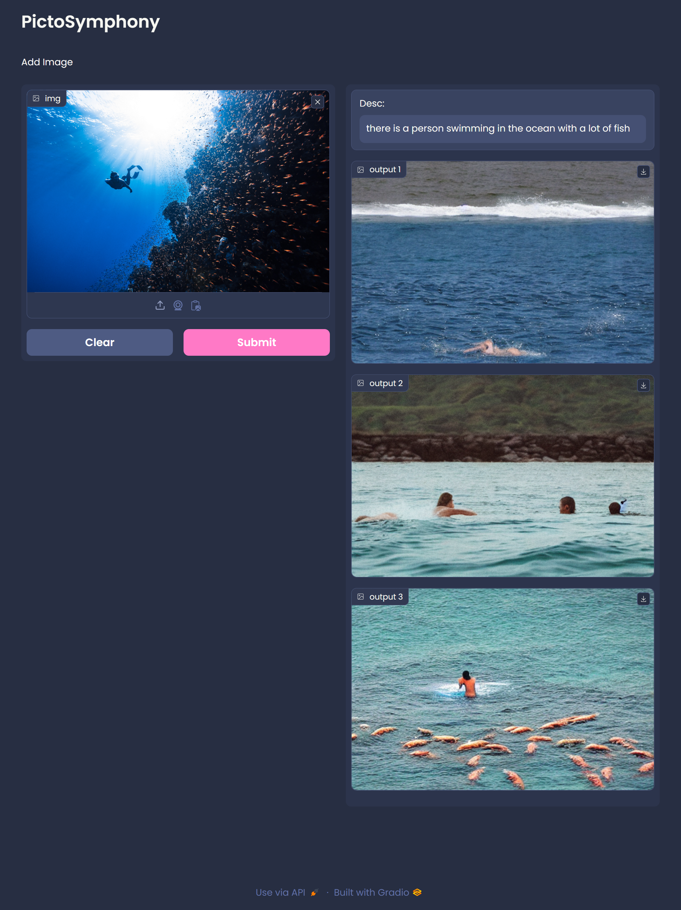

<div align="center">
  <h1>PictoSymphony</h1>
</div>
<div align="center">
  
</div>


PictoSymphony is an innovative image processing application that leverages cutting-edge technologies to provide a unique and artistic experience. It combines the power of Salesforce's blip-image-captioning-large model for image description with CompVis's stable-diffusion-v1-4 for image generation. The result is a symphony of images that transform your input into captivating visual compositions.

## Getting Started

Follow these instructions to get a copy of the project up and running on your local machine for development and testing purposes.

### Prerequisites

- Python 3.x
- Jupyter Notebook
- Google Colab account

### Installation

Clone the repository to your local machine.

```bash
git clone https://github.com/Tejas911/PictoSymphony.git
```


## Usage
Open the Interface_PictoSymphony.ipynb file in Google Colab.

Follow the instructions in the notebook to load your image and experience the magic of PictoSymphony.

## How It Works
- Image Description:

    PictoSymphony utilizes the Salesforce/blip-image-captioning-large model to generate textual descriptions of input images.
- Image Generation:

    The CompVis/stable-diffusion-v1-4 model is employed to generate visually appealing images based on the provided descriptions.
- Google Colab Integration:

    Users are recommended to use the Interface_PictoSymphony.ipynb file in Google Colab for a seamless and interactive experience.


## Demo
<div align="center">
  
</div>

<div align="center">
  
</div>

<div align="center">
    

</div>


